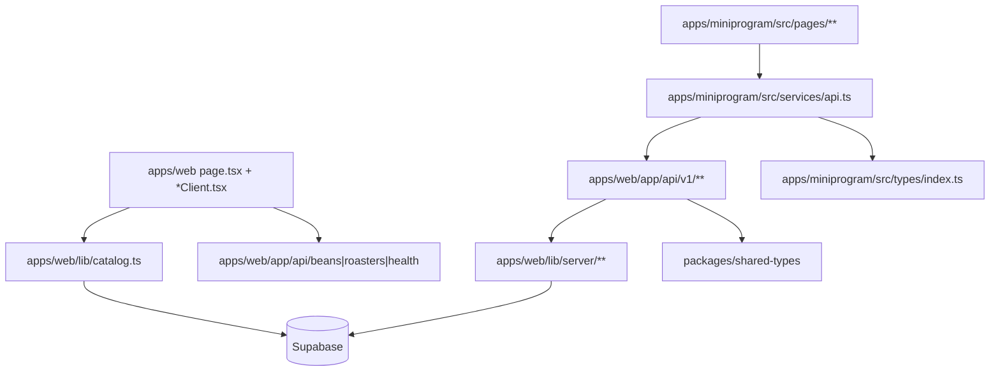

# 前端架构规范

## 多端架构概览



关键现实：

- Web 页面可以直接用 `lib/catalog.ts` 读取公开目录数据
- 小程序通过 `/api/v1/*` 调数据，不直接访问 Supabase
- `packages/shared-types` 是 v1 契约层
- `packages/api-client` 目前不是主运行时通路
- legacy `/api/beans`、`/api/roasters` 仍然存在，但不是新消费者的首选接口

---

## Web 端

### 服务端页面 + 客户端壳

当前主模式：

```tsx
// page.tsx
import HomePageClient from './HomePageClient';
import { getCatalogBeans } from '@/lib/catalog';

export default async function HomePage() {
  const initialBeans = await getCatalogBeans(50);
  return <HomePageClient initialBeans={initialBeans} />;
}
```

客户端组件只接管：

- 搜索 / tab / 主题切换
- 交互动效
- 本地 UI 状态

### Atlas UI

Atlas 体验相关组件集中在：

- `apps/web/components/atlas/OriginAtlasExplorer.tsx`
- `apps/web/components/atlas/MapSilhouette.tsx`
- `apps/web/lib/geo-data*.ts`

任何 atlas 改动都要把组件、geo data、miniprogram atlas 工具一起考虑，而不是只改一侧。

---

## 小程序端

### API 层

- 统一入口：`apps/miniprogram/src/services/api.ts`
- runtime 地址覆盖：`apps/miniprogram/src/utils/api-config.ts`
- token/header 注入：`getToken()` + request helper
- 未配置或占位地址时明确报错，不静默失败

### 状态层

- 页面状态：`useState`
- 持久状态：`utils/storage.ts`
- 登录流程：`utils/auth.ts`
- 收藏待同步队列：`pending_favorites`

---

## Cross-Layer Rules

1. 改 `/api/v1/*` 响应时，同时检查 shared-types、小程序本地类型、consumer UI
2. 改 beans/roasters discover 参数时，同时检查 Web route parser 和 miniprogram query builder
3. 改 atlas 国家/大洲数据时，同时检查 web `geo-data.ts` 和 mini `origin-atlas.ts`
4. 不要把 server-only helper 从 `apps/web/lib/server/**` 引到 client side
