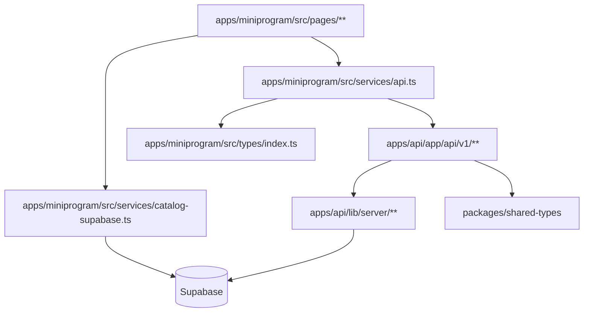

# 前端架构规范

## 多端架构概览

关键现实：

- 小程序目录读取已经可以直连 Supabase
- 登录、收藏、健康检查等仍通过 `/api/v1/*` 调数据
- `packages/shared-types` 是 v1 契约层
- `packages/api-client` 目前不是主运行时通路
- legacy `/api/beans`、`/api/roasters` 仍然存在，但不是新消费者的首选接口

---

## 小程序端

### API 层

- 统一入口：`apps/miniprogram/src/services/api.ts`
- runtime 地址覆盖：`apps/miniprogram/src/utils/api-config.ts`
- token/header 注入：`getToken()` + request helper
- 未配置或占位地址时明确报错，不静默失败

### 状态层

- 页面状态：`useState`
- 持久状态：`utils/storage.ts`
- 登录流程：`utils/auth.ts`
- 收藏待同步队列：`pending_favorites`

---

## Cross-Layer Rules

1. 改 `/api/v1/*` 响应时，同时检查 shared-types、小程序本地类型、consumer UI
2. 改 beans/roasters discover 参数时，同时检查 API route parser 和 miniprogram query builder
3. 改 atlas 国家/大洲数据时，同时检查 mini `origin-atlas.ts` 和其生成脚本
4. 不要把 server-only helper 从 `apps/api/lib/server/**` 引到 client side
