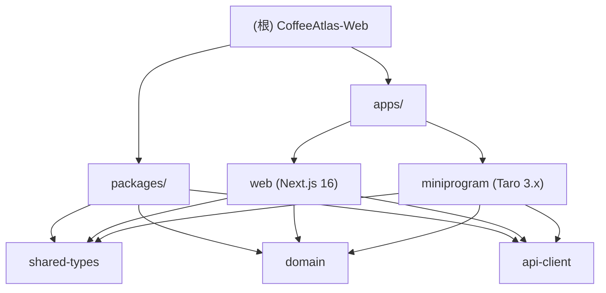

# CoffeeAtlas-Web

## 变更记录 (Changelog)

| 日期 | 版本 | 说明 |
|------|------|------|
| 2026-03-17 | v1.1 | 对齐当前仓库现实，补充全栈型 AI 协作口径 |
| 2026-03-14 | v1.0 | 初次生成，基于 Monorepo 迁移后状态扫描 |

---

## 项目愿景

CoffeeAtlas 是一个精品咖啡豆目录平台，帮助用户探索全球咖啡产区、烘焙商和豆款。
当前代码库已经是 Turborepo Monorepo，同时维护 Web 端和微信小程序（Taro）。

---

## 架构总览

- 构建工具：Turborepo + pnpm workspaces
- 包管理：pnpm 9.x（Node >= 20.9.0）
- 语言：TypeScript 5.8（strict 模式）
- 数据库：Supabase（PostgreSQL），含全文搜索（tsvector + pg_trgm）
- Web 框架：Next.js 16（App Router）
- 小程序框架：Taro 3.x（已接入当前仓库）
- 样式：Tailwind CSS v4

依赖关系：`apps/web` 和 `apps/miniprogram` 均依赖 `packages/*` 中的共享包。
共享包禁止引入 `next/*` 或 `@tarojs/*`，保持平台无关。

---

## 模块结构图



---

## 模块索引

| 模块 | 路径 | 语言 | 职责 |
|------|------|------|------|
| web | `apps/web` | TypeScript / React | Next.js Web 应用，含 API 网关和前端页面 |
| shared-types | `packages/shared-types` | TypeScript | API DTO、响应信封、查询参数类型定义 |
| domain | `packages/domain` | TypeScript | 纯领域逻辑（映射、校验），当前为骨架 |
| api-client | `packages/api-client` | TypeScript | 跨平台 fetch 客户端，供 Web CSR 和 Taro 使用 |
| miniprogram | `apps/miniprogram` | TypeScript | 微信小程序（Taro），已包含页面、组件、services、utils |

---

## 运行与开发

```bash
# 安装依赖（根目录）
pnpm install

# 全量开发（所有 apps 并行）
pnpm dev

# 仅启动 web
cd apps/web && pnpm dev

# 构建所有包（按依赖顺序）
pnpm build

# 类型检查
pnpm typecheck

# Lint
pnpm lint
```

环境变量（`apps/web/.env.local`）：

| 变量 | 说明 | 是否必须 |
|------|------|---------|
| `NEXT_PUBLIC_SUPABASE_URL` | Supabase 项目 URL | 是 |
| `NEXT_PUBLIC_SUPABASE_ANON_KEY` | 匿名 Key（浏览器端） | 是 |
| `SUPABASE_SERVICE_ROLE_KEY` | 服务端 Key（服务端专用） | 推荐 |
| `APP_JWT_SECRET` | Web 登录态签名密钥 | 微信登录 / 收藏接口必需 |
| `WECHAT_APP_ID` | 微信小程序 AppID | 微信登录链路必需 |
| `WECHAT_APP_SECRET` | 微信小程序 App Secret | 微信登录链路必需 |

小程序运行时额外使用：

| 变量 | 说明 |
|------|------|
| `TARO_APP_API_URL` | 小程序调用 Web API 的基础地址，可在本地调试时覆盖 |

未配置 Supabase 时，应用自动降级为 `lib/sample-data.ts` 中的静态数据。

数据库初始化顺序（Supabase SQL Editor）：
1. `db/sql/001_extensions.sql`
2. `db/sql/010_schema.sql`
3. `db/sql/020_indexes.sql`
4. `db/sql/030_rls.sql`
5. `db/sql/040_views_and_functions.sql`
6. `db/sql/050_seed_minimal.sql`（可选）

---

## 测试策略

- `apps/web` 配置了 Node.js 原生测试运行器（`node --test --experimental-strip-types`）
- 测试文件约定：`tests/**/*.test.ts`
- 当前已有基础测试：`api-helpers`、`new-arrivals`、`taobao-cleanup`、`taobao-sync`
- 共享包（`packages/*`）暂无测试配置

---

## 编码规范

- TypeScript strict 模式，所有包继承 `tsconfig.base.json`
- 共享包不得引入 `next/*`、`@tarojs/*` 或任何平台特定依赖
- API 响应统一使用 `{ ok: true, data, meta }` / `{ ok: false, error, meta }` 信封格式
- 数据库字段命名：snake_case；TypeScript 接口命名：camelCase
- 销量数字支持"万"单位解析（`lib/sales.ts`）

---

## AI 使用指引

### 默认角色

- 默认按全栈开发高手工作：能处理前端页面、后端 API、数据库查询/脚本、共享类型和小程序联调。
- 面对编程基础较弱但追求效率的用户时，回复保持中文、简洁、专业，不堆术语。

### 协作方式

- 先读现有实现、相关文档和仓库约束，再给方案或动手修改。
- 默认直接推进，只有在真正阻塞时才提问；提问时尽量一次问清。
- 先说结果，再说改了哪里、为什么这样改，以及用户接下来怎么验证。

### 工程边界

- 修改 `packages/*` 时，确保不引入平台特定依赖。
- `apps/web/lib/catalog.ts` 是核心数据访问层，修改前需理解 Supabase 降级逻辑与 sample fallback。
- `apps/web/lib/server/` 下的文件仅在服务端运行，不可在客户端组件中直接 import。
- 新增 API 路由应放在 `apps/web/app/api/v1/` 下，遵循 `lib/server/api-helpers.ts` 的响应格式。
- route handler 只负责解析请求、鉴权、调用 service、返回响应；不要把复杂逻辑直接堆进 `route.ts`。
- `domain` 包当前仍以骨架为主，填充时遵循 `shared-types` 的类型定义。

### 当前仓库现实

- `apps/miniprogram` 已经接入当前仓库，不再是规划中目录。
- Web 公开目录允许 sample fallback；写接口、鉴权、收藏不允许假写入。
- 微信相关上线与联调资料优先看 `apps/web/docs/wechat-cloud-debug.md` 和 `apps/web/docs/wechat-go-live-checklist.zh-CN.md`。
